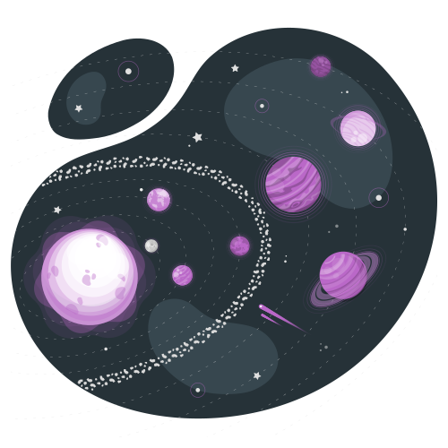

<h2> Hi! I'am, Anderson Alves Coelho! </h2>

)

# Sobre Mim
Olá, sou um analista de sistemas apaixonado por criar soluções tecnológicas inovadoras para desafios ambientais. Meu foco está em combinar tecnologia e sustentabilidade para construir um futuro melhor.
-
## 💻 Habilidades
- **Linguagens**: JavaScript, TypeScript, PHP e Python;
- **Frameworks** e Bibliotecas: React.js, React Native, Node.js, Express.js, Next.js;
- **Bancos de Dados**: PostgreSQL, MongoDB;
- **Metodologias**: Ágeis, Kanban, UX, Design Thinking;
- **Ferramentas de Versionamento**: Git, GitHub, GitLab;
- **Práticas de DevOps**: Docker.
  
## 🌱 Procurando Novas Oportunidades

Estou em busca de oportunidades que unam minha paixão pela tecnologia e meu compromisso com a sustentabilidade. Se você está buscando um desenvolvedor analista de sistemas para criar soluções inovadoras e oferecer a melhor experiência para os usuários, vamos conversar!
-
## 📞 Entre em Contato
- **Email**: seuemail@exemplo.com
- **LinkedIn**: linkedin.com/seuperfil
- **Telefone**: +55 61 99172-0125
- **Discord**: zoi0704

Estou aberto a discutir possíveis colaborações e projetos interessantes. Vamos trabalhar juntos para impulsionar a inovação tecnológica e criar um futuro sustentável através da tecnologia.
-
## 🌍 Tech + Sustentabilidade = Futuro Melhor